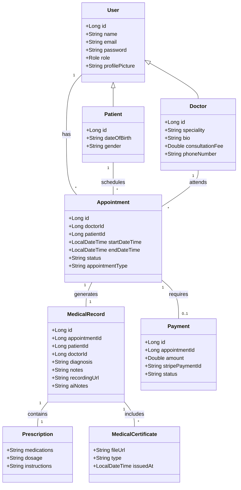

# MyDoctor - Healthcare Platform

MyDoctor is a comprehensive healthcare platform built using a microservices architecture. It provides functionalities for patient management, doctor scheduling, appointments, medical records with AI transcription, and secure payments.

## 🚀 Technology Stack

### Backend

- **Language**: Java 21
- **Framework**: Spring Boot (3.4.0 / 3.5.6)
- **Architecture**: Microservices
- **Service Discovery**: Netflix Eureka
- **API Gateway**: Spring Cloud Gateway
- **Message Broker**: Apache Kafka (for asynchronous communication)
- **Database**: PostgreSQL (per-service databases)
- **Persistence**: Spring Data JPA / Hibernate
- **Security**: Spring Security (JWT-based authentication)
- **Payment Gateway**: Stripe API
- **Utilities**: Lombok, MapStruct, Spring Validation

### Frontend

- **Framework**: Angular 18+
- **Monorepo Management**: Nx
- **Micro-frontend (MFE)**: Module Federation (Shell + Portals)
- **State Management**: RxJS, Signals
- **Styling**: Vanilla CSS / Tailwind CSS (conditional)
- **Build Tooling**: Webpack, SWC

### Infrastructure & DevOps

- **Cloud Provider**: AWS (EKS, VPC, RDS, S3)
- **Orchestration**: Kubernetes (EKS)
- **Infrastructure as Code**: Terraform
- **Containerization**: Docker, Docker Compose
- **CI/CD**: GitHub Actions
- **Logging/Monitoring**: CloudWatch (AWS)

## 🏥 Medical Documentation & Features

### Prescription

- **Workflow**: Doctors can generate prescriptions directly from the Appointment modal in the frontend.
- **Delivery**: The system automatically sends a professionally formatted email to the patient with the diagnosis and prescribed medications.
- **Storage**: Prescriptions are stored as structured text within the patient's `MedicalRecord` for future reference.

### Medical Certificate

- **Current Support**: Currently handled via the **Medical Attachments** feature. Doctors can upload signed PDF certificates or images directly to a patient's medical record.
- **Storage**: Attachments are securely stored in **AWS S3** with time-limited presigned URLs for secure access.

## 🏗️ Architecture & Class Diagram

The following diagram illustrates the core entities and their relationships across different microservices.

## 📁 Project Structure

- `backend/`: Contains all Spring Boot microservices.
- `mydoctor-mfe/`: Angular micro-frontend workspace managed by Nx.
- `k8s/`: Kubernetes manifest files for deployment.
- `terraform/`: Infrastructure as Code for AWS resource provisioning.
- `docker-compose.yml`: Local development environment setup.

## 🛠️ Getting Started

### Prerequisites

- Java 21
- Node.js & npm
- Docker & Kubernetes
- Terraform (for infrastructure)
- AWS CLI (configured)

### Local Development

1. Clone the repository.
2. Run `docker-compose up -d` to start infrastructure (Database, Kafka, Zookeeper).
3. Start the Discovery Server and API Gateway.
4. Run individual microservices using `./mvnw spring-boot:run`.
5. Start the frontend shell using `nx serve shell`.
