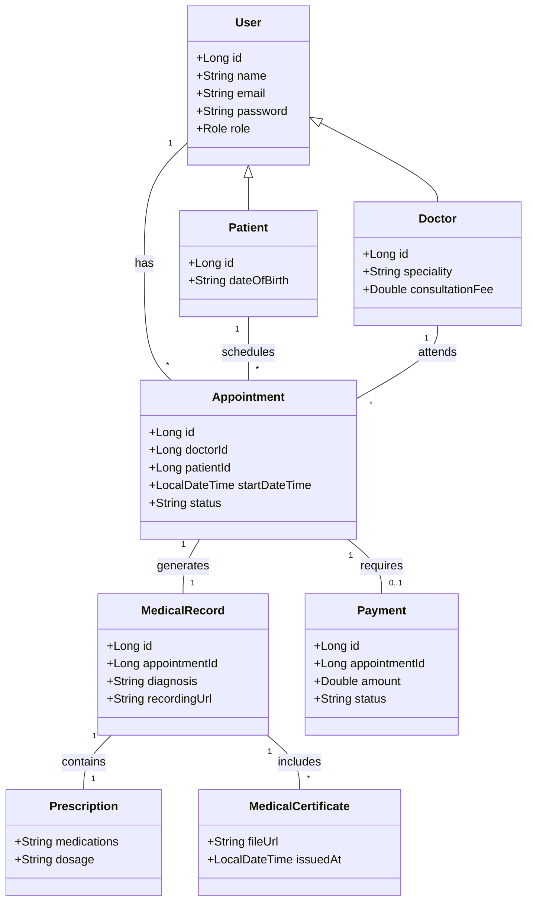

# myDoctor

Full-stack telemedicine platform with Angular micro-frontends and Spring Boot microservices, deployed to AWS EKS with Terraform.

## 🚀 Highlights & Features

- **Role-based portals**: Patient / Doctor / Admin portals with JWT authentication and profile management.
- **AI-Powered Search**: Doctor search with AI symptom-to-specialist suggestions.
- **Video Consultations**: Real-time video calls (WebRTC + STOMP/SockJS) with recording capabilities.
- **Prescription (Ordonnance)**: Doctors generate prescriptions in a modal; system sends professionally formatted emails to patients.
- **Medical Records**: Automated pipeline for S3 uploads, SQS-triggered AI transcription (Amazon Transcribe), and secure attachment management.
- **Payments**: Integrated Stripe (test mode) for appointment billing.
- **infrastructure**: Microservices architecture with Spring Cloud Gateway, Eureka discovery, and Kafka for async events.

## 🛠️ Tech Stack

- **Backend:** Java 21, Spring Boot 3.5.6, Spring Security JWT, Spring Cloud Gateway, Netflix Eureka, Spring Kafka, PostgreSQL, Stripe SDK, AWS SDK (S3, SQS, Transcribe).
- **Frontend:** Angular 18/19 (Nx workspace), TailwindCSS, Module Federation (MFE), STOMP/SockJS, WebRTC.
- **Infra/DevOps:** Docker, Kubernetes (EKS), Terraform (AWS VPC + EKS), GitHub Actions CI/CD to ECR/EKS, AWS (S3, SQS, Transcribe, KMS, CloudWatch).

## 🏗️ Architecture & Class Diagram

The following diagram illustrates the core entities and their relationships.

## 📂 Project Structure

- `backend/`: Spring Boot microservices.
- `mydoctor-mfe/`: Angular micro-frontend workspace (Nx).
- `k8s/`: Kubernetes manifest files.
- `terraform/`: Infrastructure as Code for AWS.

## 🛠️ Getting Started

### Local Development

1. Clone the repository.
2. Run `docker-compose up -d` for infrastructure (Postgres, Kafka).
3. Run services via `./start-services.sh`.
4. Run frontend via `nx serve shell` in `mydoctor-mfe`.

### Kubernetes (EKS)

1. Update kubeconfig: `aws eks update-kubeconfig --region us-east-1 --name mydoctor-cluster`
2. Apply manifests: `kubectl apply -f k8s/`
