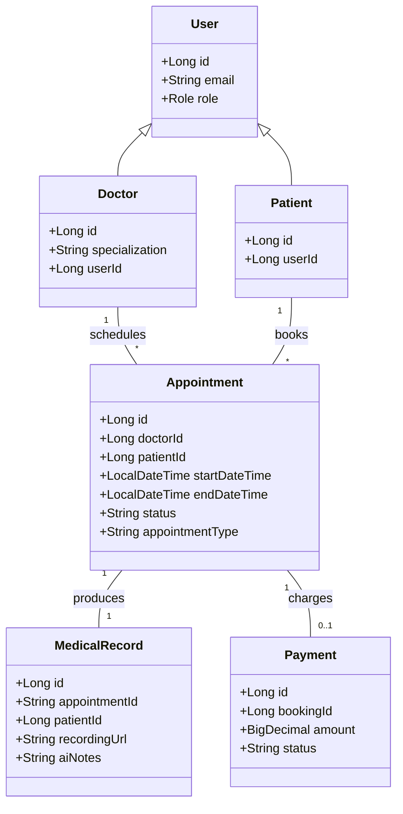

# myDoctor

Full-stack telemedicine platform with Angular micro-frontends and Spring Boot microservices, deployed to AWS EKS with Terraform.

## Highlights
- Role-based portals (Patient / Doctor / Admin), JWT auth, profile management.
- Doctor search with AI symptom-to-specialist suggestion; appointment booking with slot lookup; video consultations (WebRTC + STOMP/SockJS signaling) with recording and completion flow.
- Medical records pipeline: uploads to S3, SQS-triggered transcription (Amazon Transcribe), presigned replay links, AI notes field.
- Payments via Stripe (test mode) and appointment email notifications via Kafka consumer.
- Microservices behind Spring Cloud Gateway with Eureka discovery; PostgreSQL per service; Kafka for async events.
- Terraform-provisioned AWS: VPC, subnets, NAT GW, EKS, KMS, CloudWatch; GitHub Actions build/push to ECR and deploy to EKS; Kubernetes manifests in `k8s/` with internet-facing LB for the shell frontend.

## Tech Stack
- **Frontend:** Angular 19 (Nx workspace), TailwindCSS, STOMP/SockJS, WebRTC, Stripe JS, Nginx container.
- **Backend:** Spring Boot 3 (Java 21), Spring Security JWT, Spring Cloud Gateway, Netflix Eureka, Spring Kafka, PostgreSQL, Stripe SDK, AWS SDK (S3, SQS, Transcribe).
- **Infra/DevOps:** Docker, docker-compose, Kubernetes manifests, Terraform (AWS VPC + EKS via terraform-aws-modules), GitHub Actions CI/CD to ECR/EKS, AWS services (ECR, EKS, S3, SQS, Transcribe, KMS, CloudWatch, IAM, NAT GW).

## Architecture (services)
- discovery-server (Eureka)
- api-gateway (Spring Cloud Gateway)
- user-service (auth, users, doctors, patients, admin, notifications, signaling)
- doctor-service, patient-service (doctor/patient domain data)
- appointment-service (booking, slots, notifications → Kafka)
- medicalrecord-service (records, S3 uploads, SQS transcription pipeline)
- payment-service (Stripe intents/webhooks)
- shell frontend (Angular MFE, exposed via LoadBalancer)

## Domain Class Diagram (core flow)


## Local Development
### Prereqs
- Java 21, Node 18+, Docker, docker-compose, AWS CLI (configured) if deploying to AWS.

### Backend (all services, local ports)
- Start via Maven wrappers (service discovery first):
  ```bash
  ./start-services.sh
  # or run individual services with ./mvnw -f backend/<service>/pom.xml spring-boot:run
  ```
- Databases: PostgreSQL (see `docker-compose.yml` mounts `backend/init.sql`).

### Frontend (shell)
```bash
cd mydoctor-mfe/shell
npm install
npm start  # http://localhost:4200
```

### Full stack with docker-compose
```bash
docker compose up --build
```

## Kubernetes (EKS)
1) Ensure cluster kubeconfig: `aws eks update-kubeconfig --region us-east-1 --name mydoctor-cluster`
2) Apply configs: `kubectl apply -f k8s/config.yaml -f k8s/shell.yaml -f k8s/*.yaml`
3) Get frontend URL: `kubectl get svc shell-frontend -o jsonpath='{.status.loadBalancer.ingress[0].hostname}'`

## Terraform (AWS VPC + EKS)
```bash
cd terraform
terraform init
terraform apply -auto-approve
```
Outputs provide `configure_kubectl` and cluster endpoint; then deploy k8s manifests as above.

## CI/CD
- `.github/workflows/deploy.yml`: build backend services and shell, push to ECR, then apply k8s manifests on EKS.

## Security Note
- Rotate the secrets in `k8s/config.yaml` and `k8s/` manifests before any public deployment; move to AWS Secrets Manager/Parameter Store and use sealed secrets or env injection in CI/CD.
