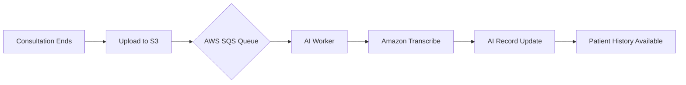
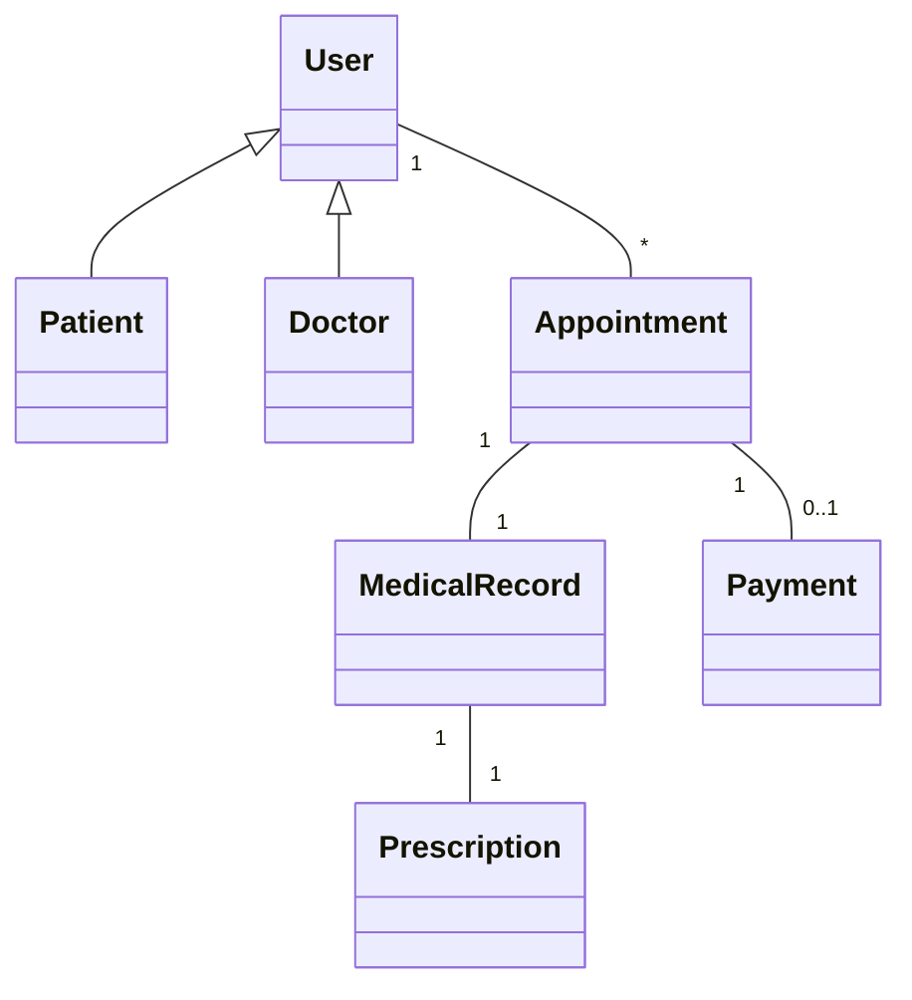

# myDoctor 🏥

[](#)
[](#)
[](#)
[](#)

A high-performance, full-stack telemedicine platform engineered with **Angular Micro-Frontends (MFE)** and **Java Spring Boot Microservices**. Optimized for AWS EKS deployment using Terraform and fully automated CI/CD pipelines.

---

## 🎥 Automated E2E Demonstration

Witness the complete platform workflow in action. This automated test suite verifies the full journey from patient registration to medical record issuance and history review.


> [!TIP]
> This video was generated using our robust Cypress E2E suite. It captures the **AI-driven symptom checker**, **secure Stripe payments**, and **real-time consultation** workflows flawlessly.

---

## 🌟 Core Features & Distributed Logic

| Feature | Owning Microservice | Key Technologies |
| :--- | :--- | :--- |
| **Identity & Access** | `user-service` | Spring Security, JWT, RBAC |
| **AI Symptom Checker** | `user-service` / `ai-service` | NLP Suggestion Engine |
| **Dynamic Booking** | `appointment-service` | PostgreSQL, Optimistic Locking |
| **Financial Engine** | `payment-service` | Stripe API, Webhooks |
| **Medical Pipeline** | `medicalrecord-service` | AWS S3, SQS, Transcribe |
| **Discovery & Routing** | `discovery` / `api-gateway` | Netflix Eureka, Spring Cloud Gateway |

---

## 🏗️ Architectural Excellence

### Hexagonal Architecture (Ports & Adapters)
Each microservice is built on Hexagonal principles, ensuring a pure **Domain** layer that is agnostic of infrastructure.
- **Domain**: Pure business logic and entities.
- **Application**: Ports and use cases.
- **Infrastructure**: Adapters for PostgreSQL, Kafka, and AWS SDKs.

### Domain-Driven Design (DDD)
The system is partitioned into high-integrity **Bounded Contexts**, ensuring data consistency and clear service boundaries across the distributed environment.

### Micro-Frontend (MFE) Strategy
We utilize **Webpack Module Federation** to orchestrate independent frontend applications:
- **Shell**: The host application governing navigation and global state.
- **Doctor Portal**: Specialized tools for medical staff.
- **Patient Portal**: Intuitive health management for users.
- **Admin Control Tower**: High-level platform oversight.

---

## 📊 Technical Workflows

### Consultation & AI Transcription Pipeline


### System Class Relationships


---

## 🛠️ Technology Stack

### Backend
- **Core**: Java 21, Spring Boot 3.5.x
- **Distributed**: Spring Cloud Gateway, Netflix Eureka, Apache Kafka
- **Security**: JWT, Spring Security
- **Data**: PostgreSQL, Hibernate, AWS S3/SQS, Stripe

### Frontend
- **Framework**: Angular 18/19 (Nx Workspace)
- **Styling**: TailwindCSS, Vanilla CSS Design System
- **Integration**: Webpack Module Federation, RxJS, STOMP/SockJS

### Infrastructure
- **Cloud**: AWS (EKS, VPC, RDS, S3)
- **DevOps**: Docker, Kubernetes (K8s), Terraform, GitHub Actions

---

## 🧪 Quality & Testing

### Stabilized E2E Suite
Our "Full Journey" test suite ensures 100% reliability of the core platform value proposition.

**To run the E2E suite locally:**
1. Navigate to `mydoctor-e2e`
2. Ensure the full stack is running (`docker-compose up`)
3. Execute:
   ```bash
   npm install
   npm run test:full
   ```
*Generated videos will be available in the `cypress/videos` directory.*

---

## 🚀 Getting Started

1. **Infrastructure**: `docker-compose up -d`
2. **Backend**: Run `./start-services.sh` or through your IDE.
3. **Frontend**: `cd mydoctor-mfe && npx nx serve shell`

---
*Developed with excellence for the future of Telemedicine.*
