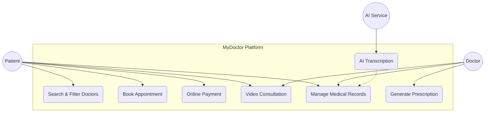
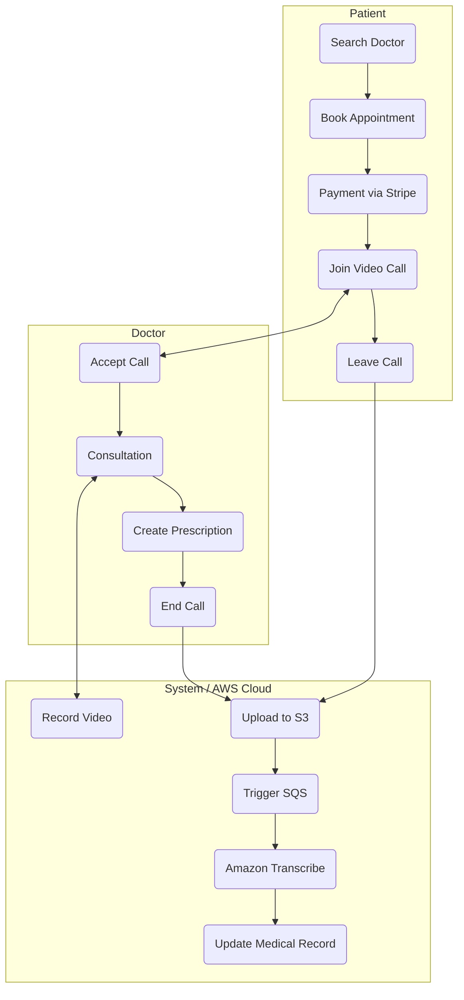
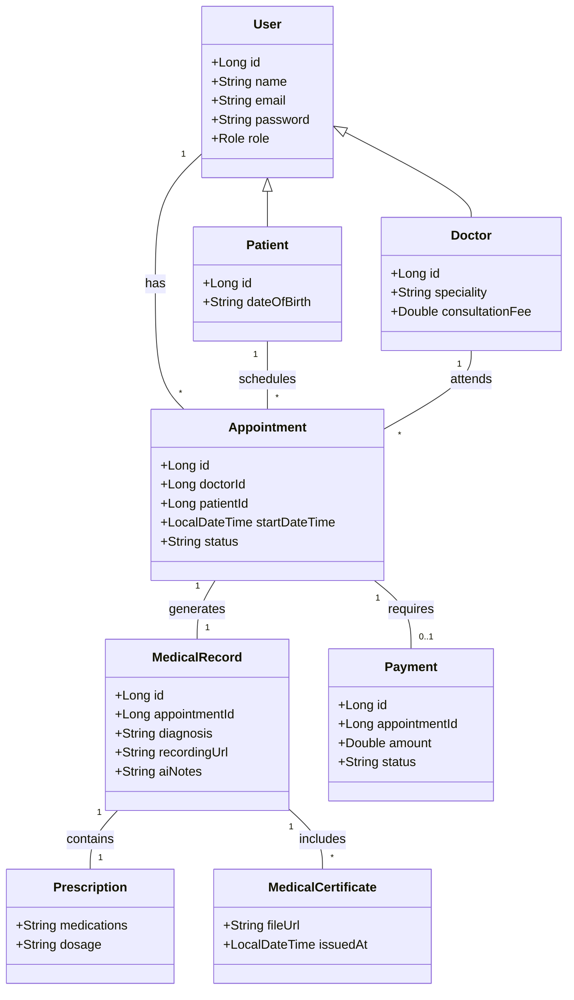

# myDoctor

Full-stack telemedicine platform with Angular micro-frontends and Spring Boot microservices, deployed to AWS EKS with Terraform.

## Features & Implementation

- **Role-based portals**: Patient, Doctor, and Admin portals with JWT authentication and profile management.
- **Doctor Search**: Search functionality with AI-driven symptom-to-specialist suggestions.
- **Video Consultations**: Integrated WebRTC and STOMP/SockJS for real-time video calls with recording support.
- **Prescription Management**: Digital prescription generation with automated email delivery to patients.
- **Medical Records**: Automated document pipeline using S3, SQS, and Amazon Transcribe for AI-driven transcription and attachment handling.
- **Payments**: Stripe integration for appointment billing and payment processing.
- **Microservices Architecture**: Distributed system using Spring Cloud Gateway, Eureka discovery, and Kafka for asynchronous event processing.

## 🎥 AI-Driven Consultation Pipeline

The platform implements a sophisticated, asynchronous pipeline for processing medical consultations:

1.  **Cloud-Based Video Recording**: Consultation streams are processed and securely stored in **AWS S3** immediately after the session.
2.  **Asynchronous Orchestration**: The `medicalrecord-service` triggers a message to **AWS SQS** upon recording completion to ensure decoupled, reliable processing.
3.  **AI Transcription**: A backend worker processes the SQS queue, invoking **Amazon Transcribe** (AI) to generate highly accurate medical transcripts from the audio.
4.  **Secure Storage**: The resulting transcriptions and AI-generated notes are linked back to the patient's `MedicalRecord` and stored in the PostgreSQL database for secure retrieval via the patient/doctor portals.
5.  **Presigned Access**: Access to these private medical files is governed by **AWS IAM** policies and time-limited presigned URLs, ensuring maximum data privacy.

## 📊 Application Workflow & Diagrams

### 🎥 Application Demonstration

*(Drop your screen recording file here once the server capacity issue resolves or after manual recording. For example: ``)*

The complete end-to-end patient workflow demonstrating:
1. **Authentication:** Secure patient login.
2. **AI Symptom Checker:** Interacting with "My AI Agent" to analyze patient symptoms.
3. **Doctor Search & Booking:** Reserving appointments with both **Standard** and **Video Consultation** options.
4. **Patient Dashboard:** Verifying the newly booked reservations directly from the patient’s personalized view.

### Use Case Diagram

Describes the interactions between users and the core system functionalities.

### Activity Diagram: Consultation Flow

Describes the step-by-step process and responsibilities (swimlanes) during a consultation.

## Technical Stack

- **Backend:** Java 21, Spring Boot 3.5.6, Spring Security JWT, Spring Cloud Gateway, Netflix Eureka, Spring Kafka, PostgreSQL, Stripe SDK, AWS SDK (S3, SQS, Transcribe).
- **Frontend:** Angular 18/19 (Nx workspace), TailwindCSS, Module Federation (MFE), STOMP/SockJS, WebRTC.
- **Infra/DevOps:** Docker, Kubernetes (EKS), Terraform (AWS VPC + EKS), GitHub Actions CI/CD to ECR/EKS, AWS (S3, SQS, Transcribe, KMS, CloudWatch).

## Design Patterns

### Architectural Patterns

- **Hexagonal Architecture (Ports & Adapters)**: Each microservice is structured following Hexagonal principles, separating the core business logic (**Domain**) from technical implementation details (**Infrastructure**) and entry points (**Web**). This ensures the business logic remains decoupled and easily testable.
- **Domain-Driven Design (DDD)**: The project follows DDD principles, emphasizing a rich domain model and clear bounded contexts for each microservice.
- **Microservices Architecture**: The system is decomposed into small, independent services (User, Appointment, Medical Record, etc.) that communicate over network protocols.
- **API Gateway Pattern**: A single entry point (Spring Cloud Gateway) handles routing, security, and cross-cutting concerns for all backend services.
- **Service Discovery**: Netflix Eureka is used for dynamic service registration and discovery, enabling horizontal scalability.
- **Database per Service**: Each microservice manages its own PostgreSQL instance, ensuring loose coupling and data encapsulation.
- **Event-Driven Architecture**: Asynchronous communication between services (e.g., Appointment to Notification) is handled via **Apache Kafka** (Pub/Sub).
- **Micro-Frontends (MFE)**: The frontend is split into independent apps using **Webpack Module Federation**, allowing for modular development and deployment.

### Backend Design Patterns

- **Layered (N-Tier) Architecture**: Traditional separation of concerns into Controller, Service, and Repository layers.
- **Dependency Injection**: Core Spring pattern used for decoupling object creation from usage.
- **Data Transfer Object (DTO)**: Used to transfer data between layers and across service boundaries without exposing internal entities.
- **Builder Pattern**: Extensively used (via Lombok) for creating complex domain objects and entities with a clear, fluent API.
- **Repository Pattern**: Abstracts data persistence logic using Spring Data JPA.

### Frontend Application Patterns

- **Observer Pattern**: Heavy use of **RxJS** Observables to handle asynchronous data streams and event-driven UI updates.
- **Component-Based Architecture**: Standard Angular approach to building reusable, encapsulated UI elements.
- **Singleton Pattern**: Angular services are provided at the root level, ensuring unique instances for shared logic and state.

## Architecture and Data Model

The following diagram illustrates the core entities and their relationships.

## Project Structure

- `backend/`: Spring Boot microservices.
- `mydoctor-mfe/`: Angular micro-frontend workspace (Nx).
- `k8s/`: Kubernetes manifest files.
- `terraform/`: Infrastructure as Code for AWS.

## Getting Started

### Local Development

1. Clone the repository.
2. Run `docker-compose up -d` for infrastructure (Postgres, Kafka).
3. Run services via `./start-services.sh`.
4. Run frontend via `nx serve shell` in `mydoctor-mfe`.

### Kubernetes (EKS)

1. Update kubeconfig: `aws eks update-kubeconfig --region us-east-1 --name mydoctor-cluster`
2. Apply manifests: `kubectl apply -f k8s/`
